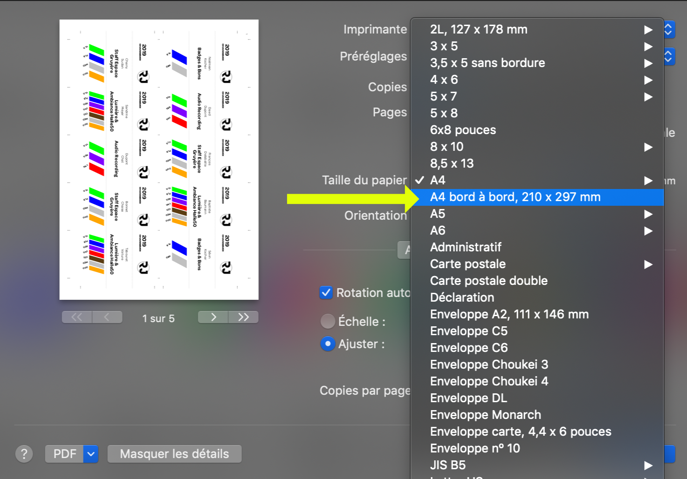
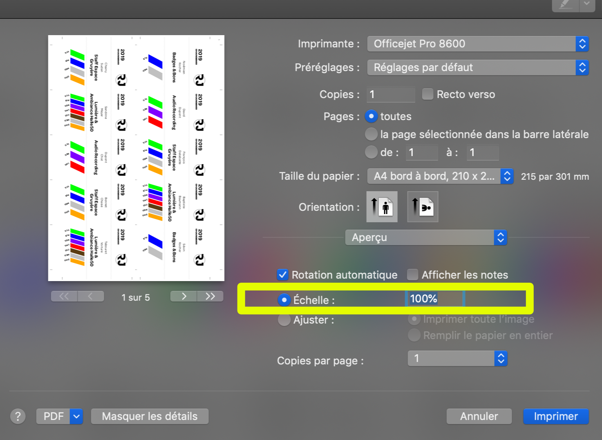
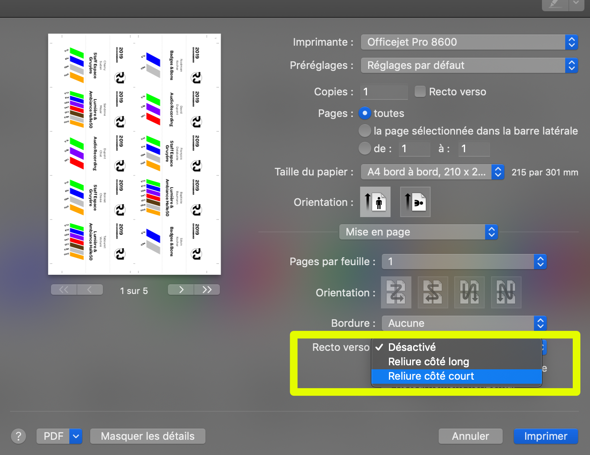

# Impression des badges

## Le fichier

Le fichier générer contient chaque page à double pour une impression recto-verso de type "côté court". Ainsi, le document devrait *toujours* avoir un nombre de pages paire.

## Le papier

Les badges fonctionnent avec le papier "PAPETERIA - Cartes de visite - 85 x 55mm". Références Migros: `7203.114, 15.06.2697`, `720311400000`. Voici le lien du produit en ligne: [https://produits.migros.ch/papeteria-cartes-de-visite-250g-100p](https://produits.migros.ch/papeteria-cartes-de-visite-250g-100p). Le format des badges est de 85x55mm.

## Configuration d'impression

Trois choses importantes:

1. Choisir une **impression bord à bord**, de format A4
2. Imprimer à l'**échelle 100%**.
3. Utiliser le recto-verso **côté court**.

En image:

### 1. Impression bord à bord A4

### 2. Imprimer à l'échelle 100%

### 3. Utiliser le recto-verso côté court

## Insertion des feuilles

- Insérer les feuilles avec les flèches en avant, face visible (manière la plus intuitive).